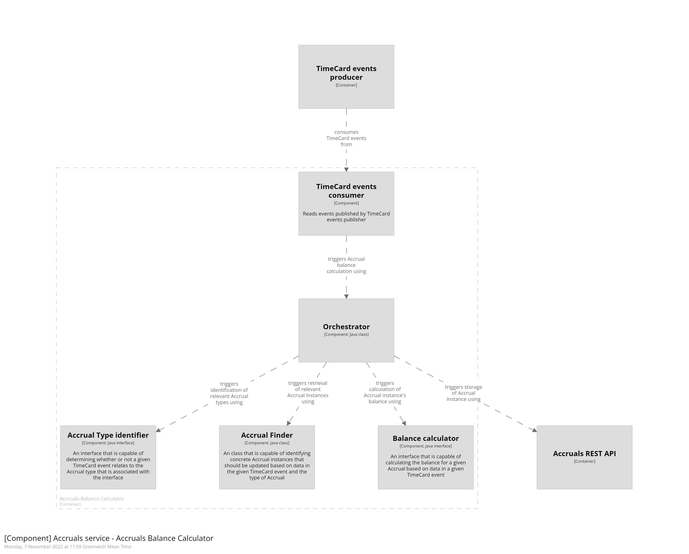
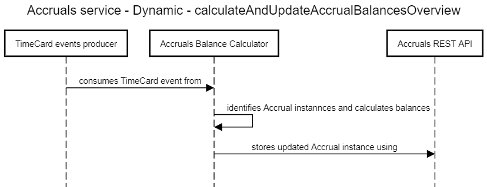

# Accruals Balance Calculator container

## Executive summary
In Border Force many people are on what is known as an Annualised Hours Agreement (AHA). In short each person will have a set of target hours that they need to work in order to gain an uplift in their basic pay. The Accruals balance calculator tracks how people are performing against those targets.

To do this it consumes events from the `callisto-timecard-restapi` container and uses the data to calculate the value of `Accraul.balance`. From there it uses the `callisto-accrual-restapi` container to persist those updated `Accrual` instances in the Accrual data store.

## What is the container for and why would you use it?
This container is responsible for making sure that Accrual balances are kept up to date so that the worker whose work is reflected in the balances has an accurate and up to date view as does their manager. Additionally scheduler's also need a view to make sure they factor in balances when planning how much work a person should be given.

The process from receiving TimeCard events to updating Accrual balances can be broken down into 4 key steps -

1. Consume event from topic
2. Identify Accrual type(s)
3. Calculate and update Accrual balances
4. Persist updated Accrual instances

[Detailed design](./orchestration/index.md)

## Dependencies
[callisto-rest-api]()
- outbound
- syncronous

[callisto-timecard-rest-api]() 
- inbound 
- asyncronous
- see [container contract](#container-contract) below.

## Container contract
- RESTful endpoints - None
- Events produced - None
- Events consumed - [`TimeEntry`]() & [`FlexChange`]() from [`callisto-timecard-rest-api`]()