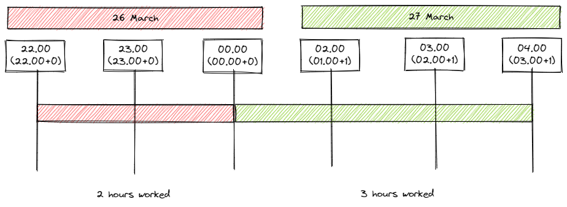
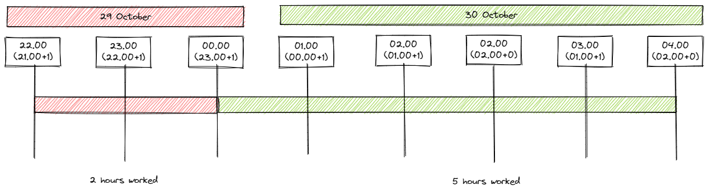

# Accrual Balance Calculation

This high-level design is intended to cover having identified the type of Accrual to update how the balance of the Accrual is calculated.

- [Accrual Balance Calculation](#accrual-balance-calculation)
  * [Updating Accrual balance](#updating-accrual-balance)
  * [How to calculate `contribution.value`](#how-to-calculate--contributionvalue-)
    + [Single day](#single-day)
    + [Overlapping day](#overlapping-day)
    + [Deletion](#deletion)
    + [Move](#move)
    + [Example Scenarios](#example-scenarios)
      - [Scenario 1:  Create a `TimeEntry` spanning a single day](#scenario-1--create-a-timeentry-spanning-a-single-day)
      - [Scenario 2: Delete an existing `TimeEntry` spanning a single day](#scenario-2-delete-an-existing-timeentry-spanning-a-single-day)
      - [Scenario 3: Move an existing `TimeEntry` spanning a single day to a different time on the same day](#scenario-3-move-an-existing-timeentry-spanning-a-single-day-to-a-different-time-on-the-same-day)
      - [Scenario 4: Create a `TimeEntry` spanning two contiguous days](#scenario-4-create-a-timeentry-spanning-two-contiguous-days)
      - [Scenario 5: Move an existing `TimeEntry` spanning a single day to two contiguous days](#scenario-5-move-an-existing-timeentry-spanning-a-single-day-to-two-contiguous-days)
      - [Scenario 6: Move an existing `TimeEntry` spanning two contiguous days a single day](#scenario-6-move-an-existing-timeentry-spanning-two-contiguous-days-a-single-day)
      - [Scenario 7: Delete an existing `TimeEntry` spanning two contiguous days](#scenario-7-delete-an-existing-timeentry-spanning-two-contiguous-days)
      - [Scenario 8: Move an existing `TimeEntry` spanning a single day to a different single day](#scenario-8-move-an-existing-timeentry-spanning-a-single-day-to-a-different-single-day)

## Updating Accrual balance
One of the key properties on an accrual record is the balance. Each instance represents the running total of all contributions up to a given date. When `TimeEntry` events are received then they are used to identify which type of `accrual` records they relate to and also to identify which date(s) are to have their balances calculated. 

**Note** 
- that the mechanism for identifying an `accrual` record type based on the data in a TimeEntry is outside of the scope of this document (see [Out of Scope](#out-of-scope))
- there will be one accrual record for each date in the current (effective) Annualised Hours Agreement. See [Out of Scope](#out-of-scope) for more information
- In the user interface when viewing Accrual balances the end user will be presented with an eroded view of their balances. The translation from the running total captured in the storage model to that eroded view will be dealt with in a separate design

A key part of an `accrual` record is its set of `contribution` records.  A contribution references a `time_entry` record and it also records how many hours of work that `time_entry` contributes to the `accrual` record's balance. 

By combining all `contribution` records for a given `accrual` record (as there could be multiple `TimeEntry` events spread over a single day) Accruals can work out the balance for a given `accrual` record. This process is described in the following sections.

## How to calculate `contribution.value`
When a new `TimeEntry` is received then Accruals must recalculate effected balances. Depending on how many contiguous days the new `TimeEntry` covers and whether or not the `TimeEntry` represents an update (typically to move time around) or a deletion then the action required is different.

### Single day
If the date portions of the `TimeEntry.actualStartTime` and `TimeEntry.actualEndTime` are for the same date then this `TimeEntry` covers a single day.

`value` = `TimeEntry.actualEndTime` - `TimeEntry.actualStartTime`

### Overlapping day
If the date portions of the `TimeEntry.actualStartTime` and `TimeEntry.actualEndTime` are for the different dates then this `TimeEntry` covers multiple days. The assumption is that the days are contiguous and that typically no more than two days are spanned. 

Use the date portions of the `TimeEntry.actualStartTime` and `TimeEntry.actualEndTime` to work out which dates are covered. From there apportion the total hours covered by the `TimeEntry` across each date. For example given the following

 - actualStartTime: `2022-06-25 19:00:00` 
 - actualEndTime: `2022-06-26 06:00:00`

The totals work out to 

 - overall total is 11 hours 
 - 25 June total is 5 hours 
 - 26 June total is 6 hours

This would trigger the creation of a `contribution` record linked to the `accrual` record that is associated with 25 June with a `value` of 5. It would also trigger the creation of a second  `contribution` record for the `accrual` record associated with 26 June with a `value` of 6 (see Scenario 4: Create a `TimeEntry` spanning two contiguous days).

### Deletion
When a `TimeEntry` is deleted (see the [event publication blueprint](https://github.com/UKHomeOffice/callisto-docs/blob/main/blueprints/event-publishing-and-consuming.md#resource-lifecycle) to understand how to detect if a `TimeEntry` has been deleted) the Accrual instance that the deleted `TimeEntry` should be associated with can be found by one of the [single](#single-day) and [overlapping](overlaping-day) approaches above. 

Once the `accrual` record has been found then a new `contribution` record must be created that references the newly received `TimeEntry` (via the `time_entry` table) and sets `value` to zero.

### Move
Sometime a `TimeEntry` is modified. In this case the `TimeEntry.version` will be incremented. It is entirely possible that a `TimeEntry` could be moved such that it no longer overlaps with the date that it did previously.

When a `TimeEntry` is received as well as matching Accruals by date as with the [single](#single-day) and [overlapping](overlaping-day) cases above the system must also look for any Accruals with `contribution` records that reference a `time_entry` record with the same `id` as the newly received `TimeEntry`. If any are found where the date range covered by the new version of  `TimeEntry` no longer overlaps with the `accrual.date` then a new `contribution` must be created that references the newly received `TimeEntry`  (via the `time_entry` table) and sets `value` to zero.

### GMT and BST (daylight saving time)
The diagrams below show examples where a person has been scheduled to work from 22.00 on one day to 04.00 on the following day. The Accruals balance calculator should expect to receive times in ISO 8061 format for reasons explained in the article [Time to Change](https://collaboration.homeoffice.gov.uk/display/EAHW/Time+to+Change) (access required)

The examples make no attempt to anticipate what a scheduler would do to account for the shift in time that moving from/to BST brings.



When moving from GMT to BST (typically last Sunday in March) it's clear that by just observing the revised time that an hour is lost therefore 3 hours would be recorded for that individual with 2 hours (22.00:00 to 00.00:00) being apportioned to the first day and 3 hours (00.00:00 to 04.00:00) apportioned to the following day.



When moving from BST to GMT (typically last Sunday in October) it's clear that by just observing the revised time that an hour is gained therefore 5 hours would be recorded for that individual with 2 hours (22.00:00 to 00.00:00) being apportioned to the first day and 3 hours (00.00:00 to 04.00:00) apportioned to the following day

To give Callisto maximum flexibility time should be stored in UTC with an offset. In this Callisto can always understand the local time when the time was recorded. UTC with an offset inherently covers the addtion and removal of an hour in mainland UK to account for daylight savings

### Example Scenarios

The scenarios below show how `accrual` and `contribution` records change in response to `TimeEntry` events that the Accruals container receives from the TimeCard container. The scenarios centre around the 24 June, 25 June and 26 June

For the purposes of the following worked examples assume that the balance on 24 June is 100. Exactly how this balance has been reached will not be broken down as it is not necessary to follow the examples through. The examples merely need a starting balance to be worked through.

For clarity JSON format has been used however in reality the data will be manipulated in the form of the [storage model](../../storage.md). In addition to make the examples leaner `accrual.type_id` has been left out.

#### Scenario 1:  Create a `TimeEntry` spanning a single day

begin state:
```json
[
  { 
    "date": "2022-06-25",
    "balance": 100 
    "contributions": []
  }  
]
```

input event:
```json
{
	"action:" "create"
	"resource": {
		"schema": "https://timecard.callisto.digital.homeoffice.gov.uk/schema/TimeEntry?version=1",
		"content": {
			"id": 1,
			"version": 1,
			"actualStartTime": "2022-06-25 08:00:00",
			"actualEndTime": "2022-06-25 18:00:00",
			"ownerId": 12,
			"shiftType" "a label of some sort",
			"timePeriodType": "shift"
		}
	}
}
```

end state:
```json
[
  { 
    "date": "2022-06-25",
    "balance": 110 
    "contributions": [
      {
        "timeEntryId": 1,
        "value": 10
      }
    ]
  }  
]
```

#### Scenario 2: Delete an existing `TimeEntry` spanning a single day

begin state:
```json
[
  { 
    "date": "2022-06-25",
    "balance": 110 
    "contributions": [
      {
        "timeEntryId": 1,
        "value": 10
      }
    ]
  }  
]
```

input event:
```json
{
	"action:" "delete"
	"resource": {
		"schema": "https://callisto.digital.homeoffice.gov.uk/schema/ResourceReference?version=1",
		"content": {
			"id": 1,
			"version": 1,
			"tenantId": 1
		}
	}
}
```

end state:
```json
[
  { 
    "date": "2022-06-25",
    "balance": 100 
    "contributions": []
  }  
]
```

#### Scenario 3: Move an existing `TimeEntry` spanning a single day to a different time on the same day


begin state: 

```json
[
  { 
    "date": "2022-06-25",
    "balance": 110 
    "contributions": [
      {
        "timeEntryId": 1,
        "value": 10
      }
    ]
  }  
]
```

input event:
```json
{
	"action:" "update"
	"resource": {
		"schema": "https://timecard.callisto.digital.homeoffice.gov.uk/schema/TimeEntry?version=1",
		"content": {
			"id": 1,
			"version": 2,
			"actualStartTime": "2022-06-25 09:00:00",
			"actualEndTime": "2022-06-25 13:00:00",
			"ownerId": 12,
			"shiftType" "a label of some sort",
			"timePeriodType": "shift"
		}
	}
}
```

end state: 

```json
[
  { 
    "date": "2022-06-25",
    "balance": 104
    "contributions": [
      {
        "timeEntryId": 1,
        "value": 4 
      }      
    ]
  }
]
```

#### Scenario 4: Create a `TimeEntry` spanning two contiguous days

begin state:
```json
[
  { 
    "date": "2022-06-25",
    "balance": 100 
    "contributions": []
  },
  { 
    "date": "2022-06-26",
    "balance": 100,
    "contributions": []
  }  
]
```

input event:
```json
{
	"action:" "create"
	"resource": {
		"schema": "https://timecard.callisto.digital.homeoffice.gov.uk/schema/TimeEntry?version=1",
		"content": {
			"id": 1,
			"version": 1,
			"actualStartTime": "2022-06-25 19:00:00",
			"actualEndTime": "2022-06-26 06:00:00",
			"ownerId": 12,
			"shiftType" "a label of some sort",
			"timePeriodType": "shift"
		}
	}
}
```

end state:
```json
[
  { 
    "date": "2022-06-25",
    "balance": 105, 
    "contributions": [
      {
        "timeEntryId": 1,
        "value": 5
      }
    ]
  },
  { 
    "date": "2022-06-26",
    "balance": 111,
    "contributions": [
      {
        "timeEntryId": 1,
        "value": 6
      }
	]
  }  
]
```

#### Scenario 5: Move an existing `TimeEntry` spanning a single day to two contiguous days

begin state:
```json
[
  { 
    "date": "2022-06-25",
    "balance": 110,
    "contributions": [
      {
        "timeEntryId": 1,
        "value": 10
      }
    ]
  },
  { 
    "date": "2022-06-26",
    "balance": 110,
    "contributions": []
  }  
]
```

input event:
```json
{
	"action:" "update",
	"resource": {
		"schema": "https://timecard.callisto.digital.homeoffice.gov.uk/schema/TimeEntry?version=1",
		"content": {
			"id": 1,
			"version": 2,
			"actualStartTime": "2022-06-25 19:00:00",
			"actualEndTime": "2022-06-26 06:00:00",
			"ownerId": 12,
			"shiftType" "a label of some sort",
			"timePeriodType": "shift"
		}
	}
}
```

end state:
```json
[
  { 
    "date": "2022-06-25",
    "balance": 105 
    "contributions": [
    {
        "timeEntryId": 1,
        "value": 5
      }
    ]
  },
  { 
    "date": "2022-06-26",
    "balance": 111,
    "contributions": [
     {
        "timeEntryId": 1,
        "value": 6
      }
    ]
  }  
]
```

#### Scenario 6: Move an existing `TimeEntry` spanning two contiguous days a single day

begin state:
```json
[
  { 
    "date": "2022-06-25",
    "balance": 105 
    "contributions": [
      {
        "timeEntryId": 1,
        "value": 5
      }
    ]
  },
  { 
    "date": "2022-06-26",
    "balance": 111,
    "contributions": [
      {
        "timeEntryId": 1,
        "value": 6
      }
	]
  }  
]
```

input event:
```json
{
	"action:" "update"
	"resource": {
		"schema": "https://timecard.callisto.digital.homeoffice.gov.uk/schema/TimeEntry?version=1",
		"content": {
			"id": 1,
			"version": 2,
			"actualStartTime": "2022-06-25 08:00:00",
			"actualEndTime": "2022-06-25 18:00:00",
			"ownerId": 12,
			"shiftType" "a label of some sort",
			"timePeriodType": "shift"
		}
	}
}
```

end state:
```json
[
  { 
    "date": "2022-06-25",
    "balance": 110 
    "contributions": [
      {
        "timeEntryId": 1,
        "value": 10
      },
    ]
  },
  { 
    "date": "2022-06-26",
    "balance": 110,
    "contributions": []
  }  
]
```

#### Scenario 7: Delete an existing `TimeEntry` spanning two contiguous days

begin state:
```json
[
  { 
    "date": "2022-06-25",
    "balance": 105 
    "contributions": [
      {
        "timeEntryId": 1,
        "value": 5
      }
    ]
  },
  { 
    "date": "2022-06-26",
    "balance": 111,
    "contributions": [
      {
        "timeEntryId": 1,
        "value": 6
      }
	]
  }  
]
```

input event:
```json
{
	"action:" "delete"
	"resource": {
		"schema": "https://callisto.digital.homeoffice.gov.uk/schema/ResourceReference?version=1",
		"content": {
			"id": 1,
			"version": 1,
			"tenantId": 1
		}
	}
}
```

end state:
```json
[
  { 
    "date": "2022-06-25",
    "balance": 100 
    "contributions": []
  },
  { 
    "date": "2022-06-26",
    "balance": 100,
    "contributions": []
  }  
]
```

#### Scenario 8: Move an existing `TimeEntry` spanning a single day to a different single day

begin state: 

```json
[
  { 
    "date": "2022-06-25",
    "balance": 110 
    "contributions": [
      {
        "timeEntryId": 1,
        "value": 10
      }
    ]
  },
  { 
    "date": "2022-06-26",
    "balance": 110,
    "contributions": []
  }  
]
```

input event:
```json
{
	"action:" "update"
	"resource": {
		"schema": "https://timecard.callisto.digital.homeoffice.gov.uk/schema/TimeEntry?version=1",
		"content": {
			"id": 1,
			"version": 2,
			"actualStartTime": "2022-06-26 08:00:00",
			"actualEndTime": "2022-06-26 18:00:00",
			"ownerId": 12,
			"shiftType" "a label of some sort",
			"timePeriodType": "shift"
		}
	}
}
```

end state: 

```json
[
  { 
    "date": "2022-06-25",
    "balance": 100
    "contributions": []
  },
  { 
    "date": "2022-06-26",
    "balance": 110,
    "contributions": [
		{
        "timeEntryId": 1,
        "value": 10
      }          
    ]
  }  
]
```


