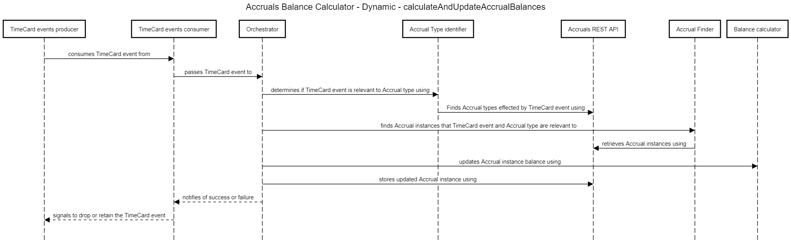

# Accrual Balance maintenance

End users do not directly make changes to Accruals data. Instead the balance-calculator component responds to events produced by the TimeCard container.

There are two main activities initiated in TimeCard that Accruals is interested in

### 1. User records their time

When a user records time in their TimeCard then the Accruals container needs to respond by updating the balances with those Accrual modules that are effected by the newly recorded time.

The Accruals container receives information about recorded time as `TimeEntry` events. The events are sent asynchronously and the component makes the assumption that they are arriving in the correct order. 

### 2. User records a flexible change
TODO

For thrse scenarios there is no RESTful component. The process is triggered by the arrival of events from the TimeCard container that encapsulate `TimeEntry` or `FlexChange` resources. The resulting data created by the processing are then stored in the Accrual container's data store. 

Other feature designs will explain how that stored data is to be exposed as resources via the Accrual's RESTful API (see [Out of Scope](#out-of-scope)). 

## Flow
The process from receiving TimeCard events to updating Accrual balances can be broken down into 4 key steps - 

1. Consume event from topic
2. Identify Accrual type(s)
3. Calculate and update Accrual balances
4. Persist updated Accrual instances

### Consume event from topic

More detail on consuming events can be found in the relevant [blueprint](https://github.com/UKHomeOffice/callisto-docs/blob/main/blueprints/event-publishing-and-consuming.md#event-consumer). 

Topic name - `callisto-timecard`

### Identify Accrual type(s)
The data in the TimeCard events and the event type itself are used to identify which types of Accrual should be updated.

There are a number of different types of Accrual and depending on the data in the TimeCard event only some will be relevant.

For detail on how to use the event data to identify which Accrual type(s) is relevant see [accrual-type-identification.md](./accrual-type-identification.md) which are broken down by Accrual type.

### Calculate and update Accrual balances
Once the Accrual types have been identified then the next step is to identify the specific Accrual instances (i.e. days). Having done that then their balances can be recalculated.

For detail on how to use the data in the TimeCard event to identify the accrual instances and how to calculate their new balances see [accrual-balance-calculation.md](./accrual-balance-calculation.md) 

### Persist updated Accrual instances
Finally, having updated the Accrual instance's balances they must be persisted to the Accruals container's datastore via a RESTful call to the `callisto-accrual-restapi` component (`PUT` [/resources/accruals](./../../rest-api/rest-endpoints.md#updateaccruals))

The sequence diagram above shows a number of components within the `accrual-balance-calculator` container. These components represent the logical steps that need to be taken in order to take the data in a TimeCard event and use it to update the balance on one or more Accrual instances.

Note that everything from TimeCard events consumer up to and including Balance calculator sits within the `balance-calculator` container. The Balance calculator on the far right of the diagram is a component within the container that happens to share a similar name.

### Components
The components map to the process outlined above

#### TimeCard events consumer
Responsible for reading TimeCard events from the `callisto-timecard` topic

#### Orchestrator
Receives TimeCard events from the consumer and coordinates the updating of the balances of all relevant Accrual instances.

The Orchestrator is responsible for ensuring that all Accrual instances have been persisted which is a result of a successful application of the logical steps outlined below. 

- Successful processing - if all of the logical steps outlined below succeed then the Orchestrator must tell the TimeCard events consumer to release the TimeCard event from the topic. 

- Failed processing - if any of the logical steps outlined below fails then the Orchestrator must tell the TimeCard events consumer to hold on to the TimeCard event from the topic. At this point the Orchestrator should try to reprocesses the event. Note that the process outlined below as a series of logical steps plus the algorithm that is referenced below are designed to be idempotent. Therefore simply reprocessing the event until success can be done indefinitely

Since the process outlined above has a dependency on the `callisto-accrual-restapi` it is possible that there could be a persistent failure to complete the process.

The implementation should guard against this by using a combination of an [exponential back off retry for transitive errors and a circuit breaker for handling persistent failure](https://dzone.com/articles/understanding-retry-pattern-with-exponential-back)

The algorithm for determining which Accrual type a TimeCard event should affect varies by Accrual type. On this basis it is envisaged that there will be a series of concrete implementations of an Accrual Type identifier interface and the Orchestrator simply cycles through each asking if the TimeCard event ties to the given Accrual type that the implementation knows about.

More detail on the specifics of identifying each type of Accrual can be found in [accrual-type-identification.md](./accrual-type-identification.md)

#### Accrual Finder
Used to find the Accrual instances that are to be updated based on data in the TimeCard event and also the type(s) of Accrual that the Accrual Type identifier returned. More information on how to use TimeCard event data along with Accrual type data can be found in [accrual-balance-calculation.md](./accrual-balance-calculation.md). 

Accrual instances are found via a RESTful call to the `callisto-accrual-restapi` component (`GET` [/resources/accruals](./../../rest-api/rest-endpoints.md#findaccruals))

#### Balance calculator
Having found the Accrual instances which are to be updated this component is responsible for calculating new balances and updating the owning Accrual instance. More information on how to use TimeCard event data to calculate a balance can be found in [accrual-balance-calculation.md](./accrual-balance-calculation.md).

### Atomic transactions
All Accruals resources that are passed to the `accuals-rest-api`'s batch update endpoint should be committed in a single transaction.

In the design presented here all Accrual resources are sent in a single call to the batch update endpoint. 

This means that updating cannot be done in parallel. If this approach proves to be unacceptable (performance SLAs yet to be established) then the updating could be divided into smaller batches that could be executed in parallel. At a minimum all Accruals of the same type should be batched together in a call to the batch update endpoint. 

Note that regardless of whether or not the orchestration is implemented as a parallel process all Accrual resources must be updated successfully before the TimeCard event can be released by the TimeCard event consumer. The process has been designed to be idempotent such that the same event can be replayed again and again.

## Considerations
- **Number of calls to `callisto-accruals-restapi`** - the Orchestrator component makes use of a number of other components some of which will call out to the RESTful endpoints exposed by `callisto-accruals-restapi`. A decision needs to be made as to whether or not to write the orchestrator such that calls are batched up or sent individually. There are two classes of call for which this decision needs to be made: Accrual finder & Accrual storage. One could imagine finding or updating all Accrual instances for every relevant Accrual type all at once or batching them up by type

## Out of scope
- Exposing Accrual resources via RESTful endpoints. This will be covered elsewhere.
- Seeding of accrual records based on an AH Agreement. This will be covered by a separate design involving the [TAMS Agreement Adapter](https://github.com/UKHomeOffice/callisto-docs/blob/main/containers.md#tams-agreement-adapter)
