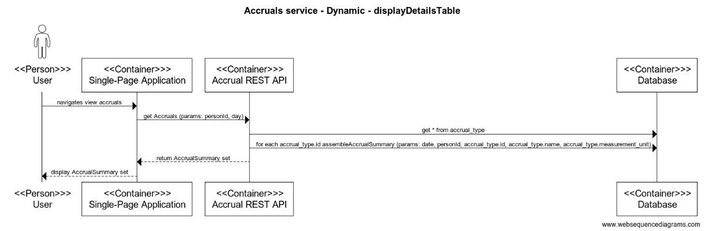
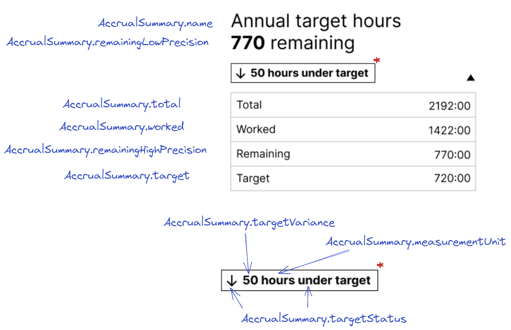

# Calculate Accrual Summary

The Accruals REST API exposes a number of resources that are calculated at query-time as opposed to being retrieved from the data store and returned to the client as-is.

One of these is `AccrualSummary` which provides an overview of a specific type of Accrual for a specific date. Pulls together data from a number of different tables in the data store.

- [AccrualSummary endpoint](./../rest-endpoints.md#opIdgetAccrualSummaries)
- [Storage model](./../storage.mdstorage.md)



There will be one `AccrualSummary` per accrual_type regardless of whether or not the person has bought the given Accrual type.

## Steps to build an `AccrualSummary`
Step one in terms of assembling AccrualSummary instances is to query the [`accrual_type`](./../storage.md#tables) table and return all rows. 

The next step is to loop through each row in the result set and use the data for that accrual_type row to drive the creation of an [`AccrualSummary`](./../rest-endpoints.md#getaccrualsummaries)

<table>
<thead>
  <tr>
    <th>Property</th>
    <th>Source</th>
    <th>Source type</th>
  </tr>
</thead>
<tbody>
  <tr>
    <td>name</td>
    <td><a href="./../storage.md#accrual_type">accrual_type.name</a></td>
    <td>accrual_type resultset</td>
  </tr>
  <tr>
    <td>measurementUnit</td>
    <td><a href="./../storage.md#accrual_type">accrual_type.measurement_unit</a></td>
    <td>accrual_type resultset</td>
  </tr>
  <tr>
    <td>personId</td>
    <td><a href="./../rest-endpoints.md#opIdgetAccrualSummarys">personId</a></td>
    <td>HTTP query param</td>
  </tr>
  <tr>
    <td>date</td>
    <td><a href="./../rest-endpoints.md#opIdgetAccrualSummarys">date</a></td>
    <td>HTTP query param</td>
  </tr>
  <tr>
    <td>target</td>
    <td><b>TODO</b> - this value cannot yet be populated as its calculation is dependent on the seeding of accrual records which will be covered as part of the work to ingest Agreement data</td>
    <td>table (probably)</td>
  </tr>
  <tr>
    <td>remainingHighPrecision</td>
    <td><b>TODO</b> - this value cannot yet be populated as its calculation is dependent on being able to populate the total property (total - worked)</td>
    <td>table (probably)</td>
  </tr>
  <tr>
    <td>remainingLowPrecision</td>
    <td>
		  <li><b>input(s): </b>remainingHighPosition</li>
      <li><b>process: </b>round down to the nearest whole number</li>
		  <li><b>output(s): </b>rounded value</li>  
    </td>        
    <td>calculated</td>
  </tr>
  <tr>
    <td>targetVariance</td>
    <td><b>TODO</b> - this value cannot yet be populated as its calculation is dependent on being able to populate the target and remainingHighPrecision properties (remainingHighPrecision - target)</td>
    <td>calculated (probably)</td>
  </tr>
  <tr>
    <td>agreementVariance</td>
    <td><b>TODO</b> - this value cannot yet be populated as its calculation is dependent on being able to populate the total property (total - worked). Note there is a question over whether this property is needed as the remainingHighPrecision carries the same value. If it goes negative then we infer that the person has worked over their agreed amount (i.e. the total).</td>        
	</td>
    <td>calculated</td>
  </tr>
  <tr>
    <td>targetStatus</td>
    <td><a href="#target-status-calculation">target status calculation</a></td>
    <td>calculated</td>
  </tr>
  <tr>
    <td>worked</td>
    <td>
        <li><b>input(s): </b>personId, date, accrual_type.id</li>
        <li><b>process: </b>DB query</li>
        <li><b>output(s): </b>accrual.balance</li>
    <td>table</td>
  </tr>
  <tr>
    <td>total</td>
    <td><b>TODO</b> - this value cannot yet be populated as its calculation is dependent on being able to populate the totalNetOrGrossOfPH property and ingestion of Agreement data</td>
    <td>calculated (probably)</td>
  </tr>
  <tr>
    <td>totalNetOrGrossOfPH</td>
    <td><b>TODO</b> - this value cannot yet be populated as its calculation is dependent on the person table being defined along with the RESTful endpoints used to manage it. Also need to think about how to onboard this data and where from</td>
    <td>table</td>
  </tr>
</tbody>
</table>

### Target status calculation
The calculation for target status varies depending on the point in the Agreement period that the target is describing.

- March - In the month of March the surplus/deficit value is used to determine whether the status is over/under or on target. For details see [Jira - Visual Indicator Over/under/on Target (March)](https://collaboration.homeoffice.gov.uk/jira/browse/EAHW-2048)
- April to Feb - the tolerance rate %age bands are used to determine whether the status is over/under or on target. For details see [Jira - Visual Indicator Over/under/on Target (April to February)](https://collaboration.homeoffice.gov.uk/jira/browse/EAHW-1899)

## Mapping to web user interface
The image below shows how the properties in an `AccrualSummary` map on to the web user interface.

The block of JSON represents the `AccrualSummary` instance that would drive the population of this user interface view.

```json
{
  "name": "Annual Target Hours",
  "personId": 143,
  "date": "20122-10-24",
  "measurementUnit": "time",
  "total": 2192.0,
  "worked": 1422.0,
  "totalNetOrGrossOfPH": "net_of_ph",
  "target": 720.0,
  "remainingLowPrecision": 770,
  "remainingHighPrecision": 770.0,
  "targetVariance": 50.0,
  "agreementVariance": 0.0,
  "targetStatus": "under_target"
}
```

