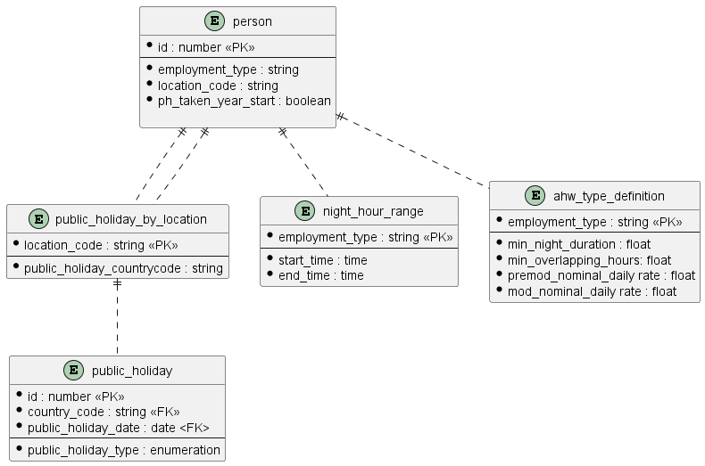

# Calculate Is Normal Shift

The Accruals REST API exposes a number of resources that are calculated at query-time as opposed to being retrieved from the data store and returned to the client as-is.

This document explains which resources they are and how their various properties are calculated

## Normal Shift

If an individual works at least 'n' hours, where n is usually 4 the shift qualifies as a 'normal' shift.

This endpoint simply returns whether the data supplied qualifies as a normal shift.

- [Is Normal Shift endpoint](./../rest-endpoints.md#opIdisNormalShift)
- [Storage model](./../storage.md)

### Calculation

There are a number of factors involved in whether a shift qualifies for a normal (or All Shift) count.

* A working period greater than min_shift_duration hours during a day, weekend or public holiday shift 

* Night shift greater than min_overlapping_hours hours between the defined night hour range 

The data retrieval is relatively trivial. There are three tables to be accessed to acquire the data required. 

| Table                 | Accessed by      | Provides                |
| --------------------- | ---------------- | ----------------------- |
|                       |                  |                         |
| Person                | PersonId         | employment\_type        |
| night\_hour\_range    | employment\_type | start\_time, end\_time  |
| ahw\_type\_definition | employment\_type | min\_shift\_duration |
|                       |                  |                         |

These tables can also be seen in the following image:

