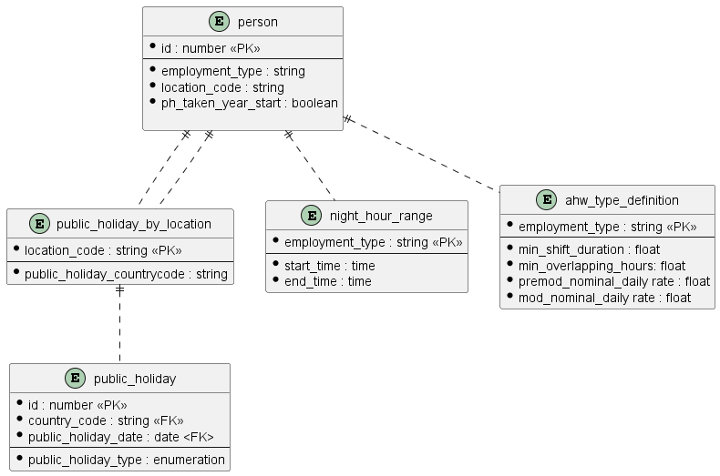

# Calculate Is Public Holiday

The Accruals REST API exposes a number of resources that are calculated at query-time as opposed to being retrieved from the data store and returned to the client as-is.

This document explains which resources they are and how their various properties are calculated

## Public Holiday

This endpoint simply returns whether the date supplied is a Public Holiday for the nation (England, Scotland, Wales & Northern Island) to which the person making the call belongs.

It does this by pulling together data from a number of different tables in the data store.

- [Is Public Holiday endpoint](./../rest-endpoints.md#opIdisPublicHoliday)
- [Storage model](./../storage.md)

### Calculation

The look up is relatively trivial. There are three tables defined and the relationships are shown in the table below:

| Table                         | Accessed by    | Provides                                     |
| ----------------------------- | -------------- | -------------------------------------------- |
|                               |                |                                              |
| Person                        | PersonId       | Location\_Code                               |
| Public\_Holiday\_By\_Location | Location\_Code | Public\_Holiday\_CountryCode                 |
| Public\_Holiday               | CountryCode    | Public\_Holiday\_Date, Public\_Holiday\_Type |
|                               |                |                                              |

These tables can also be seen in the following image:

