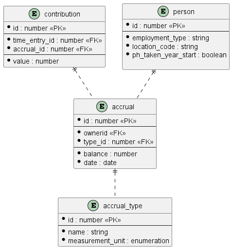
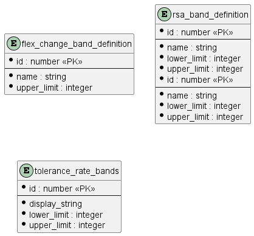

<h1 id="accruals">Accruals v0.1.0</h1>

The Accruals container stores a number of entities. There are three different type of entities stored within this container and it is useful to consider those differences as each are maintained in different ways. 

The main categories are:

* Core tables actively created, updated or deleted by a service.
* Data owned by another service and maintained using event consumption.
* Tables of largely static 'reference data' owned, maintained and used by a service and not shared with other services. 

# Core Tables

Principal amongst the core tables is the `accrual` table. It's relationship to the other core tables is depicted below

## Tables
<h2 id="tocS_TimeEntry">time_entry</h2>

A `TimeEntry` carries the time periods during which employees have performed a business activity (e.g. PCP, dog handling etc) or HR activity (e.g. leaves, training etc). `TimeEntry` is the actual recording of hours done by employees as per their roster. Encapsulates day and time (to the minute). 

A `TimeEntry` will originate with the TimeCard container and will be consumed by the Accruals container as an event

### Properties

|Name|Type|Required|Restrictions|Description|
|---|---|---|---|---|
|id|PK|true|none|Assigned by the Accruals container though ideally the id from the `TimeEntry` published by the TimeCard container should be used to make reconciliation easier|
|version|number|true|none|The version of the `time_entry` record as assigned by the TimeCard container. The Accruals container has no need to change this. This field is simply a copy of the value from the `time_entry` record published by the TimeCard container|
|owner_id|number|true|none|The id of the Person who owns this `time_entry` record i.e. the Person who has performed the activity in the given time period|
|actual_start_time|string(date-time)|true|none|The start time of the activity that was worked (to the minute)|
|actual_end_time|string(date-time)|true|none|The end time of the activity that was worked (to the minute)|

<h2 id="tocS_FlexChange">flex_change</h2>

A FlexChange is used to carry details of an alteration to a planned shift. For a FlexChange to be created there are business rules governing how far in advance of the shift the alteration was made.

A FlexChange will originate with the TimeCard container and will be consumed by the Accruals container as an event.

### Properties

|Name|Type|Required|Restrictions|Description|
|---|---|---|---|---|
|id|PK|true|none|Assigned by the Accruals container though ideally the id from the `FlexChange` published by the TimeCard container should be used to make reconciliation easier|
|time_entry_id|FK ([`TimeEntry`](#tocS_time_entry))|true|none|The id of the `time_entry` record associated with the FlexChange|

<h2 id="tocS_Accrual">accrual</h2>

Represents the balance of an accrual on a given date.

### Properties

|Name|Type|Required|Restrictions|Description|
|---|---|---|---|---|
|id|PK|true|none|the identifier for this Accrual|
|type_id|FK ([accrual_type](#tocS_Accrual_Type))|true|none|the type of this Accrual. Sometimes referred to as the "module"|
|balance|number|true|none|The remaining balance on for the accrual on the given date. Default is zero|
|date|date|true|none|The date that the Accrual is associated with|

<h2 id="tocS_Contribution">contribution</h2>

A contribution towards the balance of an Accrual

### Properties

|Name|Type|Required|Restrictions|Description|
|---|---|---|---|---|
|id|PK|true|none|the identifier for this Contribution|
|time_entry_id|FK ([time_entry](#tocS_TimeEntry))|true|none|The TimeEntry records an amount of time that backs the contributedHours property|
|accrual_id|FK ([accrual](#tocS_Accrual))|true|none|The balance of the `Accrual` that this `Contribution` effects|
|value|number|true|none|Holds the count that this `Contribution` negates the `Accrual`'s balance by|

**REF DATA - accrual type and units etc, name**
<h2 id="tocS_Accrual_Type">accrual_type</h2>

Reference data that linked to a type of `Accrual`

### Properties

|Name|Type|Required|Restrictions|Description|
|---|---|---|---|---|
|id|PK|true|none|the identifier for this `accrual_type` record|
|name|string|true|none|The human readable name for this `accrual_type` |
|measurement_unit|string|true|one of 'hours' or 'count'|The way that the balance of an Accrual of this `accrual_type` should be interpreted|

# Reference Data supplied externally

If there are tables that exist as reference data maintained by another service they will be documented here:

Their relationship to the other tables is depicted below

## Tables

<h2 id="tocS_Person">person</h2>

There are several attributes of a person that will be required by the Accruals container in order for it to perform the necessary calculations. The data required is a local copy of only the data required by and pertinent to the Accruals module and is maintained by the Person Service.

### Properties

|Name|Type|Required|Restrictions|Description|
|---|---|---|---|---|
|id| PK| true|none|id of the person|
|employment_type|string|true|none|The AHW variation or employment type. Values are AAA, AHA, SDA, IPA, FlexibleWorker|
|location_code|string|true|none|Key into the location table i.e BIRMINGHAM_INTERNATIONAL_AIRPORT|

<h2 id="tocS_Public_Holiday">public_holiday</h2>

Different nations within the United Kingdom have different Public Holidays and therefore configuration is required to permit this flexibility to be configured. In addition certain Public Holidays occur on different dates depending upon the calendar year.

### Properties
|Name|Type|Required|Restrictions|Description|
|---|---|---|---|---|
|id| PK| true|none|Assigned when a new row is added to this table by the owning service|
|country_code| FK| true|none|The countrycode - England, Scotland, Wales, NI for Public Holiday purposes|
|public_holiday_date|date|true|none|The date of the public holiday|
|public_holiday_type|enumeration|true|none|Statutory, Substitute|

<h2 id="tocS_Public_Holiday_By_Location">public_holiday_by_location</h2>

Different nations within the United Kingdom have different Public Holidays and therefore configuration is required to permit this flexibility to be configured. This table allows every location to have a country code assigned.

### Properties
|Name|Type|Required|Restrictions|Description|
|---|---|---|---|---|
|id| PK| true|none|Assigned when a new row is added to this table by the owning service|
|location_code| FK| true|none|The countrycode - England, Scotland, Wales, NI for Public Holiday purposes|
|public_holiday_countrycode| | true|none|The countrycode - England, Scotland, Wales, NI for Public Holiday purposes|

<h2 id="tocS_Night_Hour_Range">night_hour_range</h2>

Night shifts are normally rostered between the hours of 06.00 – 23.00hrs but this can vary based on AHW employment typoe i.e AHA, SDA etc. A shift/time-entry can be classified as Night one if it overlaps by MinimumOverlappingHoursRequired (e.g. 3 hours) or more with this range.

### Properties
|Name|Type|Required|Restrictions|Description|
|---|---|---|---|---|
|id| PK| true|none|Assigned when a new row is added to this table by the owning service|
|employment_type| FK| true|none|The employment_type for this individual from the person record|
|start_time|string|true|none|The time when a night shift must start on or after to qualify as a night shift|
|end_time|string|true|none|The time when a night shift must end on or before to qualify as a night shift|

<h2 id="tocS_AHW_Type_Definition">AHW_type_definition</h2>

Staff on different AHW contract types (AAA, SDA etc) have different parameters which affect the calculation of their accruals. This table holds those variations.

### Properties

|Name|Type|Required|Restrictions|Description|
|---|---|---|---|---|
|id| PK| true|none|Assigned when a new row is added to this table by the owning service|
|employment_type| FK| true|none|The employment_type for this individual from the person record|
|min_night_duration|float|true|none|Minimum duration of a night shift to qualify|
|min_overlapping_hours|float|true|none|Number of hours a shift must overlap a night hour range to qualify as night shift|
|premod_nominal_daily_rate|float|true|none|Number of hours for a day of full time premodernised employee| 
|mod_nominal_daily_rate|float|true|none|Number of hours for a day of full time modernised employee| 

# Reference Data owned solely by accruals

If there are tables that exist as reference data used and maintained solely by this service are documented here

Their relationship to the other tables is depicted below

<h2 id="tocS_Flex_Change_Band_Definition">flex_change_band_definition</h2>

To compensate staff for flexibility in their working and the level of predictability of their roster, staff are paid an uplift. There are four levels of payment which are to be configured in the table below.

### Properties

|Name|Type|Required|Restrictions|Description|
|---|---|---|---|---|
|id| PK| true|none|Assigned when a new row is added to this table by the owning service|
|name|string|true|none|There are 4 levels of flexibility represented by this table at present, A, B, C or D|
|upper\_limit|integer|true|none|Currently the upper limits for bands A through D are 24, 49, 75 and unlimited represented by 999|

<h2 id="tocS_RSA_Band_Definition">rsa_band_definition</h2>

Staff who are on a shift roster basis can qualify for the Rostered Shift Allowance, which is an allowance paid for a user being rostered to do a certain amount of night shifts. The more night shifts a user is rostered on to, the more they get paid – represented by 4 bands.

| Level | Number of compulsory short term notice changes to roster per year | % of basic salary |
| ----- | ----------------------------------------------------------------- | ----------------- |
| A     | 1 to 24 changes                                                   | 2%                |
| B     | Between 25 and 49 changes                                         | 5%                |
| C     | 50 – 75 changes                                                   | 7.5%              |
| D     | 76 + changes\*                                                    | 10%               |

The details above will be represented with 4 records in the table below.

### Properties

|Name|Type|Required|Restrictions|Description|
|---|---|---|---|---|
|id| PK| true|none|Assigned when a new row is added to this table by the owning service|
|name|string|true|none|There are 4 levels of flexibility represented by this table at present, A, B, C or D|
|lower\_limit|integer|true|none|Currently the upper limits for bands A through D are 11, 8, 5 , 1| 
|upper\_limit|integer|true|none|Currently the upper limits for bands A through D are 999, 10, 7, 4|

<h2 id="tocS_Tolerance_Rate_Bands">tolerance_rate_bands</h2>

A persons deviation from their target rate is displayed as being within a band. There are a number of bands which are displayed on the user interface as shown below

* 25%+
* 15% to 24%
* 6% to 14% 
* -5% to 5%
* -6% to -14%
* -15% to -24%
* -25%+

This table allows the upper and lower percentages to be defined and related to the display string.

### Properties

|Name|Type|Required|Restrictions|Description|
|---|---|---|---|---|
|id| PK| true|none|Assigned when a new row is added to this table by the owning service|
|display_string|string|true|none|The text displayed for a given percentage difference between target and balance|
|lower\_limit|integer|true|none|Defines the lower limit for this band| 
|upper\_limit|integer|true|none|Defines the upper limit for this band|

