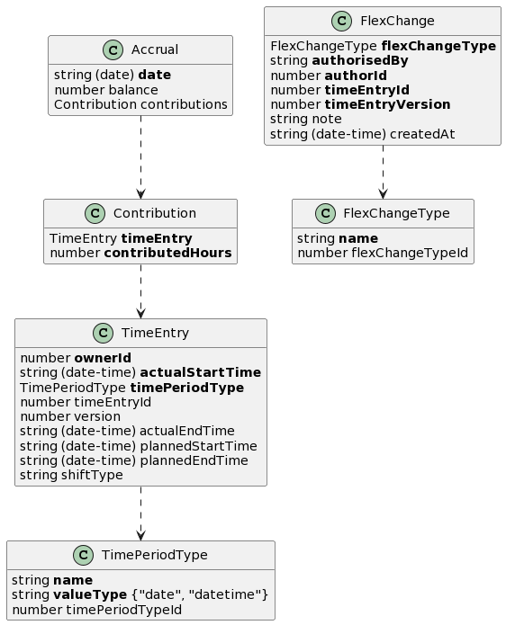

# Annual Target Hours

This high-level design is intended to cover the Annual Target Hours Feature which includes the user stories listed below. It seeks to:

1.  Guide the reader through the relevant parts of the container definitions which will be used to satisfy this feature.
2.  Where required illustrate the high-level container orchestration.
3.  Detail and explain the relevant parts of the data model impacting this feature.

Annual Target Hours [feature definition](https://collaboration.homeoffice.gov.uk/jira/browse/EAHW-1249) (access required) in Jira details the user stories that make up the feature. The user stories contain more detailed requirement around business rules and validation logic. The intention is that this document should be used as a guide when designing and implementing and testing against a given story from the record time feature

To understand the proposed high-level design, it is instructive to consider both the definition of the [containers](./../index.md) used to perform the key actions and the appropriate parts of the [payload model](./../../payload.md) specifically [Accrual](./../../payload.md#accrual).

## Flows
End users do not directly make changes to Accruals data. Instead the Accruals container responds to a set of events from other Callisto containers and external systems.

There are three sources of events - 

 1. TimeCard container 
 2. Scheduler container
 3. Agreement container (adapter for the TAMS external system that masters Agreements)

### TimeCard trigger
There are two main activities initiated in TimeCard that Accruals is interested in

#### User records their time
This covers creating a brand new record of time worked or updating or removing an existing one. More detail about how this process is triggered, the key steps in the process and associated data are described in more detail :warning: [here](./timecard-timeentry.md) :warning:

#### User records a flexible change
**TODO - detailed flow**

### Scheduler trigger
Accruals is interested in the publication of a schedule which in part is made up of planned time periods. Accruals is also interested in changes to those planned time periods be it updates or deletes.

**TODO - detailed flow**

### Agreement trigger
The Agreement container is relevant at two key points

#### Agreement publication 
**TODO - detailed flow**

#### User on-boarding
Agreements are effective in the period 01 April to 31 March. Onboarding users on to Callisto can happen at any point. On this basis it is very likely that when the time comes for a user to be onboarded they will be part way through the agreement period. In order to ensure that Callisto can accurately track accruals from the point of onboarding it must know what the user's balances were at the time of onboarding.

Just as balances need to be brought in to Callisto as part of onboarding so to do their associated Agreements. In effect this can be seen as an ad-hoc [Agreement publication](#agreement-publication). It is imperative that balances are linked to the Agreement they relate to. An agreement contains one or more purchased AHA modules. Each balance is for a module and each module has a target. The Agreement contains the target for each purchased module.

**TODO - detailed flow**

## Payload model

This section describes which parts of the Accruals container's payload model are relevant when tracking annual hours. More information can be found in the [payload model definition](./../../payload.md). The key resource for the record time feature is the [Accrual](./../../payload.md#accrual).

## Considerations

## Out of scope

### Business rules
It is anticipated that business rule validation they will be dealt with at the component level

### Authorisation
AuthN/AuthZ forms part of a wider design that will be covered separately
            |

