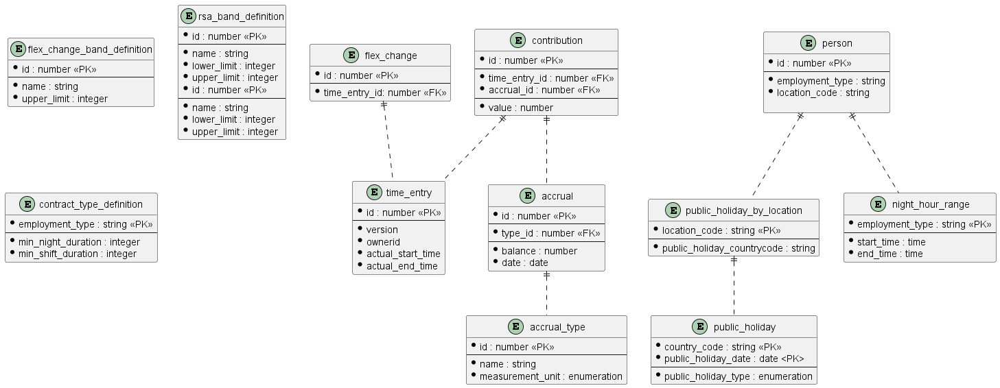

# User records their time
When a user records time in their TimeCard then the Accruals container needs to respond by updating the balances with those Accrual modules that are effected by the newly recorded time.

**Communication of recorded time**

The Accruals container receives information about recorded time as `TimeEntry` events. The events are sent asynchronously and the container makes the assumption that they are arriving in the correct order. 

For this scenario there is no RESTful component. The process is triggered by the arrival of events from the TimeCard container that encapsulate `TimeEntry` resources. The resulting data created by the processing are then stored in the Accrual container's data store. Other feature designs will explain how that stored data is to be exposed as resources via the Accrual's RESTful API (see [Out of Scope](#out-of-scope). 

**Storage models**

As mentioned above the [`TimeEntry`](https://github.com/UKHomeOffice/callisto-timecard-restapi/blob/main/docs/payload.md#timeentry) encapsulates the data that the Accruals container uses to update balances. Internally balance data is held by in the [`accrual` table](../../storage.md#accrual)



## Updating Accrual balance
One of the key properties on an accrual record is the balance. Each instance represents the balance on a given date. When `TimeEntry` events are received then they are used to identify which type of `accrual` records they relate to and also to identify which date(s) are to have their balances calculated. Note that the mechanism for identifying an `accrual` record type based on the data in a TimeEntry is outside of the scope of this document (see [Out of Scope](#out-of-scope). 

A key part of an `accrual` record is its set of `contribution` records.  A contribution references a `time_entry` record and it also records how many hours of work that `time_entry` contributes to the `accrual` record's balance. 

By combining all `contribution` records for a given `accrual` record (as there could be multiple `TimeEntry` events spread over a single day) Accruals can work out the balance for a given `accrual` record. This process is described in the following sections.

### How to calculate `contribution.value`
When a new `TimeEntry` is received then Accruals must recalculate effected balances. Depending on how many contiguous days the new `TimeEntry` covers and whether or not the `TimeEntry` represents an update (typically to move time around) or a deletion then the action required is different.

#### Single day
If the date portions of the `TimeEntry.actualStartTime` and `TimeEntry.actualEndTime` are for the same date then this `TimeEntry` covers a single day.

`value` = `TimeEntry.actualEndTime` - `TimeEntry.actualStartTime`

#### Overlapping day
If the date portions of the `TimeEntry.actualStartTime` and `TimeEntry.actualEndTime` are for the different dates then this `TimeEntry` covers multiple days. The assumption is that the days are contiguous and that typically no more than two days are spanned. 

Use the date portions of the `TimeEntry.actualStartTime` and `TimeEntry.actualEndTime` to work out which dates are covered. From there apportion the total hours covered by the `TimeEntry` across each date. For example given the following

 - actualStartTime: `2022-06-25 19:00:00` 
 - actualEndTime: `2022-06-26 06:00:00`

The totals work out to 

 - overall total is 11 hours 
 - 25 June total is 5 hours 
 - 26 June total is 6 hours

This would trigger the creation of a `contribution` record linked to the `accrual` record that is associated with 25 June with a `value` of 5. It would also trigger the creation of a second  `contribution` record for the `accrual` record associated with 26 June with a `value` of 6 (see Scenario 4: Create a `TimeEntry` spanning two contiguous days).

#### Deletion
When a `TimeEntry` is deleted (see the [event publication blueprint](https://github.com/UKHomeOffice/callisto-docs/blob/main/blueprints/event-publishing-and-consuming.md#resource-lifecycle) to understand how to detect if a `TimeEntry` has been deleted) the Accrual instance that the deleted `TimeEntry` should be associated with can be found by one of the [single](#single-day) and [overlapping](overlaping-day) approaches above. 

Once the `accrual` record has been found then a new `contribution` record must be created that references the newly received `TimeEntry` (via the `time_entry` table) and sets `value` to zero.

#### Move
Sometime a `TimeEntry` is modified. In this case the `TimeEntry.version` will be incremented. It is entirely possible that a `TimeEntry` could be moved such that it no longer overlaps with the date that it did previously.

When a `TimeEntry` is received as well as matching Accruals by date as with the [single](#single-day) and [overlapping](overlaping-day) cases above the system must also look for any Accruals with `contribution` records that reference a `time_entry` record with the same `id` as the newly received `TimeEntry`. If any are found where the date range covered by the new version of  `TimeEntry` no longer overlaps with the `accrual.date` then a new `contribution` must be created that references the newly received `TimeEntry`  (via the `time_entry` table) and sets `value` to zero.

### Example Scenarios

The scenarios below show how `accrual` and `contribution` records change in response to `TimeEntry` events that the Accruals container receives from the TimeCard container. The scenarios centre around the 24 June, 25 June and 26 June

For the purposes of the following worked examples assume that the balance on 24 June is 100. Exactly how this balance has been reached will not be broken down as it is not necessary to follow the examples through. The examples merely need a starting balance to be worked through.

For clarity JSON format has been used however in reality the data will be manipulated in the form of the [storage model](../../storage.md).

#### Scenario 1:  Create a `TimeEntry` spanning a single day

begin state:
```yaml
[
  { 
    "date": "2022-06-25",
    "balance": 100 
    "contributions": []
  }  
]
```

input event:
```yaml
{
	"action:" "create"
	"resource": {
		"schema": "https://timecard.callisto.digital.homeoffice.gov.uk/schema/TimeEntry?version=1",
		"content": {
			"id": 1,
			"version": 1,
			"actualStartTime: "2022-06-25 08:00:00",
			"actualEndTime": "2022-06-25 18:00:00",
			"ownerId": 12,
			"shiftType" "a label of some sort",
			"timePeriodType": "shift"
		}
	}
}
```

end state:
```yaml
[
  { 
    "date": "2022-06-25",
    "balance": 90 
    "contributions": [
      {
        "timeentry": 
        {
          "actualStartTime": "2022-06-25 08:00:00",
          "actualEndTime": "2022-06-25 18:00:00",
          "id":1
        },
        "value": 10
      }
    ]
  }  
]
```

#### Scenario 2: Delete an existing `TimeEntry` spanning a single day

begin state:
```yaml
[
  { 
    "date": "2022-06-25",
    "balance": 90 
    "contributions": [
      {
        "timeentry": 
        {
          "actualStartTime": "2022-06-25 08:00:00",
          "actualEndTime": "2022-06-25 18:00:00",
          "id":1
        },
        "value": 10
      }
    ]
  }  
]
```

input event:
```yaml
{
	"action:" "delete"
	"resource": {
		"schema": "https://callisto.digital.homeoffice.gov.uk/schema/ResourceReference?version=1",
		"content": {
			"id": 1,
			"version": 1,
			"tenantId": 1
		}
	}
}
```

end state:
```yaml
[
  { 
    "date": "2022-06-25",
    "balance": 100 
    "contributions": []
  }  
]
```

#### Scenario 3: Move an existing `TimeEntry` spanning a single day to a different time on the same day


begin state: 

```yaml
[
  { 
    "date": "2022-06-25",
    "balance": 90 
    "contributions": [
      {
        "timeentry": 
        {
          "actualStartTime": "2022-06-25 08:00:00",
          "actualEndTime": "2022-06-25 18:00:00",
          "id":1
        },
        "value": 10
      }
    ]
  }  
]
```

input event:
```yaml
{
	"action:" "create"
	"resource": {
		"schema": "https://timecard.callisto.digital.homeoffice.gov.uk/schema/TimeEntry?version=1",
		"content": {
			"id": 1,
			"version": 2,
			"actualStartTime": "2022-06-25 09:00:00",
			"actualEndTime": "2022-06-25 13:00:00",
			"ownerId": 12,
			"shiftType" "a label of some sort",
			"timePeriodType": "shift"
		}
	}
}
```

end state: 

```yaml
[
  { 
    "date": "2022-06-25",
    "balance": 96
    "contributions": [
      {
        "timeentry": 
        {
          "actualStartTime": "2022-06-25 09:00:00",
          "actualEndTime": "2022-06-25 13:00:00",
          "version": 2,
          "deleted": "false",
          "id":1
        },
        "value": 4 
      }      
    ]
  }
]
```

#### Scenario 4: Create a `TimeEntry` spanning two contiguous days

begin state:
```yaml
[
  { 
    "date": "2022-06-25",
    "balance": 100 
    "contributions": []
  },
  { 
    "date": "2022-06-26",
    "balance": 89,
    "contributions": []
  }  
]
```

input event:
```yaml
{
	"action:" "create"
	"resource": {
		"schema": "https://timecard.callisto.digital.homeoffice.gov.uk/schema/TimeEntry?version=1",
		"content": {
			"id": 1,
			"version": 1,
			"actualStartTime": "2022-06-25 19:00:00",
			"actualEndTime": "2022-06-26 06:00:00",
			"ownerId": 12,
			"shiftType" "a label of some sort",
			"timePeriodType": "shift"
		}
	}
}
```

end state:
```yaml
[
  { 
    "date": "2022-06-25",
    "balance": 95 
    "contributions": [
      {
        "timeentry": 
        {
          "actualStartTime": "2022-06-25 19:00:00",
          "actualEndTime": "2022-06-26 06:00:00",
          "id":1
        },
        "value": 5
      }
    ]
  },
  { 
    "date": "2022-06-26",
    "balance": 89,
    "contributions": [
      {
        "timeentry": 
        {
          "actualStartTime": "2022-06-25 19:00:00",
          "actualEndTime": "2022-06-26 06:00:00",
          "id":1
        },
        "value": 6
      }
	]
  }  
]
```

#### Scenario 5: Move an existing `TimeEntry` spanning a single day to two contiguous days

begin state:
```yaml
[
  { 
    "date": "2022-06-25",
    "balance": 90 
    "contributions": [
      {
        "timeentry": 
        {
          "actualStartTime": "2022-06-25 08:00:00",
          "actualEndTime": "2022-06-25 18:00:00",
          "id":1
        },
        "value": 10
      }
  },
  { 
    "date": "2022-06-26",
    "balance": 90,
    "contributions": []
  }  
]
```

input event:
```yaml
{
	"action:" "create"
	"resource": {
		"schema": "https://timecard.callisto.digital.homeoffice.gov.uk/schema/TimeEntry?version=1",
		"content": {
			"id": 1,
			"version": 1,
			"actualStartTime": "2022-06-25 19:00:00",
			"actualEndTime": "2022-06-26 06:00:00",
			"ownerId": 12,
			"shiftType" "a label of some sort",
			"timePeriodType": "shift"
		}
	}
}
```

end state:
```yaml
[
  { 
    "date": "2022-06-25",
    "balance": 95 
    "contributions": [
    "timeentry": 
       {
          "actualStartTime": "2022-06-25 19:00:00",
          "actualEndTime": "2022-06-26 06:00:00",
          "id":1
        },
        "value": 5
      }
    ]
  },
  { 
    "date": "2022-06-26",
    "balance": 89,
    "contributions": [
     {
        "timeentry": 
        {
          "actualStartTime": "2022-06-25 19:00:00",
          "actualEndTime": "2022-06-26 06:00:00",
          "id":1
        },
        "value": 6
      }
	]
  }  
]
```

#### Scenario 6: Move an existing `TimeEntry` spanning two contiguous days a single day

begin state:
```yaml
[
  { 
    "date": "2022-06-25",
    "balance": 95 
    "contributions": [
      {
        "timeentry": 
        {
          "actualStartTime": "2022-06-25 19:00:00",
          "actualEndTime": "2022-06-26 06:00:00",
          "id":1
        },
        "value": 5
      }
    ]
  },
  { 
    "date": "2022-06-26",
    "balance": 89,
    "contributions": [
      {
        "timeentry": 
        {
          "actualStartTime": "2022-06-25 19:00:00",
          "actualEndTime": "2022-06-26 06:00:00",
          "id":1
        },
        "value": 6
      }
	]
  }  
]
```

input event:
```yaml
{
	"action:" "create"
	"resource": {
		"schema": "https://timecard.callisto.digital.homeoffice.gov.uk/schema/TimeEntry?version=1",
		"content": {
			"id": 1,
			"version": 1,
			"actualStartTime": "2022-06-25 08:00:00",
			"actualEndTime": "2022-06-25 18:00:00",
			"ownerId": 12,
			"shiftType" "a label of some sort",
			"timePeriodType": "shift"
		}
	}
}
```

end state:
```yaml
[
  { 
    "date": "2022-06-25",
    "balance": 90 
    "contributions": [
      {
        "timeentry": 
        {
          "actualStartTime": "2022-06-25 08:00:00",
          "actualEndTime": "2022-06-25 18:00:00",
          "id":1
        },
        "value": 10
      },
    ]
  },
  { 
    "date": "2022-06-26",
    "balance": 90,
    "contributions": []
  }  
]
```

#### Scenario 7: Delete an existing `TimeEntry` spanning two contiguous days

begin state:
```yaml
[
  { 
    "date": "2022-06-25",
    "balance": 95 
    "contributions": [
      {
        "timeentry": 
        {
          "actualStartTime": "2022-06-25 19:00:00",
          "actualEndTime": "2022-06-26 06:00:00",
          "id":1
        },
        "value": 5
      }
    ]
  },
  { 
    "date": "2022-06-26",
    "balance": 89,
    "contributions": [
      {
        "timeentry": 
        {
          "actualStartTime": "2022-06-25 19:00:00",
          "actualEndTime": "2022-06-26 06:00:00",
          "id":1
        },
        "value": 6
      }
	]
  }  
]
```

input event:
```yaml
{
	"action:" "delete"
	"resource": {
		"schema": "https://callisto.digital.homeoffice.gov.uk/schema/ResourceReference?version=1",
		"content": {
			"id": 1,
			"version": 1,
			"tenantId": 1
		}
	}
}
```

end state:
```yaml
[
  { 
    "date": "2022-06-25",
    "balance": 100 
    "contributions": []
  },
  { 
    "date": "2022-06-26",
    "balance": 100,
    "contributions": []
  }  
]
```

#### Scenario 8: Move an existing `TimeEntry` spanning a single day to a different single day

begin state: 

```yaml
[
  { 
    "date": "2022-06-25",
    "balance": 90 
    "contributions": [
      {
        "timeentry": 
        {
          "actualStartTime": "2022-06-25 08:00:00",
          "actualEndTime": "2022-06-25 18:00:00",
          "id":1
        },
        "value": 10
      }
    ]
  },
  { 
    "date": "2022-06-26",
    "balance": 90,
    "contributions": []
  }  
]
```

input event:
```yaml
{
	"action:" "create"
	"resource": {
		"schema": "https://timecard.callisto.digital.homeoffice.gov.uk/schema/TimeEntry?version=1",
		"content": {
			"id": 1,
			"version": 1,
			"actualStartTime": "2022-06-26 08:00:00",
			"actualEndTime": "2022-06-26 18:00:00",
			"ownerId": 12,
			"shiftType" "a label of some sort",
			"timePeriodType": "shift"
		}
	}
}
```

end state: 

```yaml
[
  { 
    "date": "2022-06-25",
    "balance": 100
    "contributions": []
  },
  { 
    "date": "2022-06-26",
    "balance": 90,
    "contributions": [
		{
        "timeentry": 
        {
          "actualStartTime": "2022-06-26 08:00:00",
          "actualEndTime": "2022-06-26 18:00:00",
          "id":1
        },
        "value": 10
      }          
    ]
  }  
]
```

## Considerations
[Consuming events](https://github.com/UKHomeOffice/callisto-docs/blob/main/blueprints/event-publishing-and-consuming.md#event-consumer)

## Out of scope
- Exposing Accrual resources via RESTful endpoints. This will be covered elsewhere.
- Identifying relevant Accrual module(s) based on `TimeEntry` data. The business rules under the [Annual Target Hours feature](https://collaboration.homeoffice.gov.uk/jira/browse/EAHW-1249) in Jira should be consulted.
