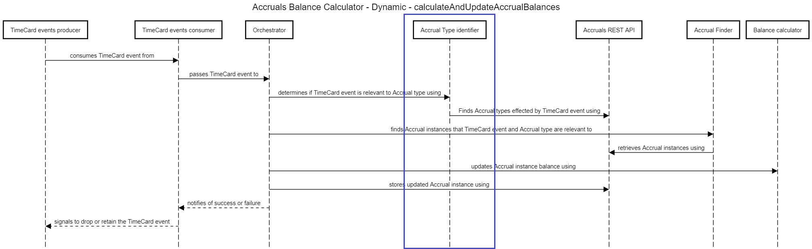

# Annual Target Hours

This design covers how one goes about using the data from a `TimeEntry` event to update Accrual instances which represent the Annual Target Hours type.

Much of the Accrual balance calculation logic is common across types. The variation comes in when trying to determine whether or not a `TimeEntry` is related to Annual Target Hours (see blue box). For more detail on this flow see the [detailed design](../containers/balance-calculator/orchestration/index.md) for balance calculation.

## Resources
- For background on the Accruals system, what it is and the different containers that make it up see the root [index.md](../index.md)
- For how to identify whether or not Annual Target Hours [`Accrual instances`](./../containers/rest-api/storage.md#tables) should be updated see [accrual-type-identification.md](./../containers/balance-calculator/orchestration/accrual-type-identification.md#annual-target-hours)
- For how to to go from consuming a `TimeEntry` event to updating an Accrual balance see the [detailed design](./../containers/balance-calculator/orchestration/index.md)
- For how to build an `AccrualSummary` instance to support the web user interface in displaying accrual balance data see [calculate-and-display-accrual-summary.md](./../containers/rest-api/orchestration/calculate-and-display-accrual-summary.md)

