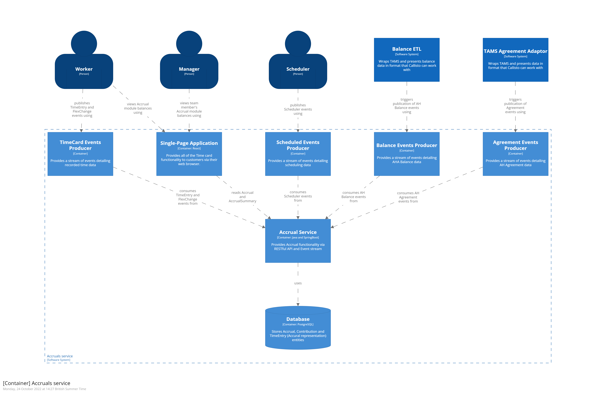

# Accruals container

## Executive summary
In Border Force many people are on what is known as an Annualised Hours Agreement (AHA). In short each person will have a set of target hours that they need to work in order to gain an uplift in their basic pay. The Accruals container tracks how people are performing against those targets.

## What is the container for and why would you use it?
**TODO** 
 
## Dependencies
**TODO**

## Container contract
**TODO**