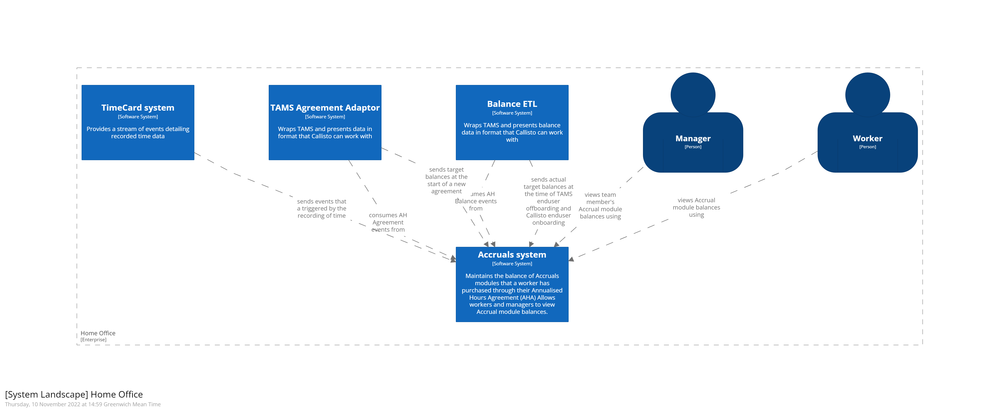

# Accruals system

In Border Force many people are on what is known as an Annualised Hours Agreement (AHA). In short each person will have a set of target hours that they need to work in order to gain an uplift in their basic pay. 

The hours that they work fall into one or more different categories, which are sometimes called modules or often reffered to as accruals.

### User goals
Boiling it down, Accruals supports four key areas of functionality. Follow the links below to the detailed design covering that goal.

- [Calculating accrual balances ](./containers/balance-calculator/orchestration/index.md)
- [Viewing balance(s)](./containers/rest-api/orchestration/calculate-and-display-accrual-summary.md)
- Tracking balances changes over time - TODO
- Viewing how balances have changed over time (statement) - TODO

## Contents

- [features](./features/) - the features that make up accruals' functionality. Features link off to the containers and the parts of the containers that support them. 
- [containers](./containers/) - each container that makes up accruals has it's own design. These designs support the features of the accruals system
- [container-model.c4](./container-model.c4) - a C4 model of the system, used to generate images that visualise the API of the container and components within it

