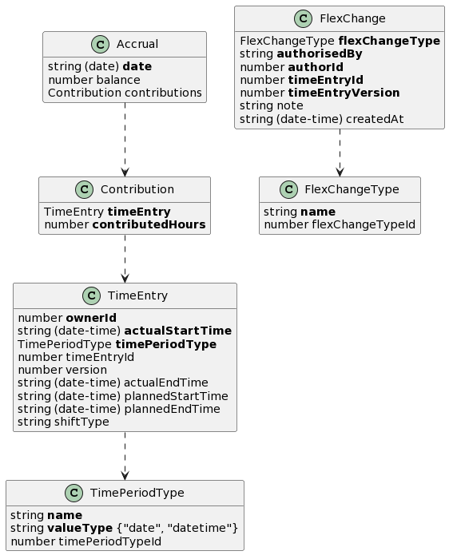

<!-- Generator: Widdershins v4.0.1 -->

<h1 id="accruals">Accruals v0.1.0</h1>

The Accruals container exposes a number of models to clients. The Accrual and Accrual summary are key models from which most others hang



# Schemas

<h2 id="tocS_TimePeriodType">TimePeriodType</h2>
<!-- backwards compatibility -->
<a id="schematimeperiodtype"></a>
<a id="schema_TimePeriodType"></a>
<a id="tocStimeperiodtype"></a>
<a id="tocstimeperiodtype"></a>

```json
{
  "timePeriodTypeId": 0,
  "name": "string",
  "valueType": "date"
}

```

A way to categorise time periods (e.g. a shift, a standard rest day). Depending on the type of time period the actual time value that should be recorded against that period varies. For example to record a shift time period two data points are needed - a shift start datetime and and a shift end datetime. Contrast this with a standard rest day where only a single date is needed.

### Properties

|Name|Type|Required|Restrictions|Description|
|---|---|---|---|---|
|timePeriodTypeId|number|false|none|the identifier for this TimePeriodType|
|name|string|true|none|the display name of this TimePeriodType|
|valueType|string|true|none|The value that a time period of this type should contain|

#### Enumerated Values

|Property|Value|
|---|---|
|valueType|date|
|valueType|datetime|

<h2 id="tocS_TimeEntry">TimeEntry</h2>
<!-- backwards compatibility -->
<a id="schematimeentry"></a>
<a id="schema_TimeEntry"></a>
<a id="tocStimeentry"></a>
<a id="tocstimeentry"></a>

```json
{
  "timeEntryId": 0,
  "version": 0,
  "ownerId": 0,
  "actualStartTime": "2019-08-24T14:15:22Z",
  "actualEndTime": "2019-08-24T14:15:22Z",
  "plannedStartTime": "2019-08-24T14:15:22Z",
  "plannedEndTime": "2019-08-24T14:15:22Z",
  "shiftType": "string",
  "timePeriodType": {
    "timePeriodTypeId": 0,
    "name": "string",
    "valueType": "date"
  }
}

```

A TimeEntry carries the time periods during which employees have performed a business activity (e.g. PCP, dog handling etc) or HR activity (e.g. leaves, training etc). TimeEntry is the actual recording of hours done by employees as per their roster. Encapsulates day and time (to the minute). The TimeEntry also holds the concept of planned time. In this instance the owner of the TimeEntry has been rostered to perform some work in the future at a specified time. Not all TimeEntry owners are subject to their time being planned out therefore the fields related to planned time are optional. It is also possible to create a TimeEntry with just an actualStartTime and to provide the actualEndTime later. However if planned time is provided then both the start and end must be set.

### Properties

|Name|Type|Required|Restrictions|Description|
|---|---|---|---|---|
|timeEntryId|number|false|none|Assigned by the TimeCard container|
|version|number|false|none|The version of the TimeEntry as assigned by the TimeCard container. This value changes when the resource is created, updated, or deleted.|
|ownerId|number|true|none|The id of the Person who owns this TimeEntry i.e. the Person who has performed the activity in the given time period|
|actualStartTime|string(date-time)|true|none|The start time of the activity that was worked (to the minute)|
|actualEndTime|string(date-time)|false|none|The end time of the activity that was worked (to the minute)|
|plannedStartTime|string(date-time)|false|none|The start time of the activity that has been planned (to the minute)|
|plannedEndTime|string(date-time)|false|none|The end time of the activity that has been planned (to the minute)|
|shiftType|string|false|none|a descriptor for the shift (eg 'early shift')|
|timePeriodType|[TimePeriodType](#schematimeperiodtype)|true|none|The type of time entry (e.g. a shift, a standard rest day)|

<h2 id="tocS_FlexChangeType">FlexChangeType</h2>
<!-- backwards compatibility -->
<a id="schemaflexchangetype"></a>
<a id="schema_FlexChangeType"></a>
<a id="tocSflexchangetype"></a>
<a id="tocsflexchangetype"></a>

```json
{
  "flexChangeTypeId": 0,
  "name": "string"
}

```

The type of flexible change. The type drives business rules that govern how much notice the shift worker must have been given. In addition certain types of FlexChange cannot be combined on the same TimeEntry

### Properties

|Name|Type|Required|Restrictions|Description|
|---|---|---|---|---|
|flexChangeTypeId|number|false|none|the identifier for this FlexChangeType|
|name|string|true|none|the display name of this FlexChangeType|

<h2 id="tocS_FlexChange">FlexChange</h2>
<!-- backwards compatibility -->
<a id="schemaflexchange"></a>
<a id="schema_FlexChange"></a>
<a id="tocSflexchange"></a>
<a id="tocsflexchange"></a>

```json
{
  "flexChangeType": {
    "flexChangeTypeId": 0,
    "name": "string"
  },
  "authorisedBy": "string",
  "note": "string",
  "createdAt": "2019-08-24T14:15:22Z",
  "authorId": 0,
  "timeEntryId": 0,
  "timeEntryVersion": 0
}

```

A FlexChange is used to carry details of an alteration to a planned shift. For a FlexChange to be created there are business rules governing how far in advance of the shift the alteration was made

### Properties

|Name|Type|Required|Restrictions|Description|
|---|---|---|---|---|
|flexChangeType|[FlexChangeType](#schemaflexchangetype)|true|none|Holds the note's text|
|authorisedBy|string|true|none|free text field holding the name of the person who authorised the creation of the flexible change. Authorisation is handled outside of Callisto|
|note|string|false|none|hold arbitrary information about the flexible change|
|createdAt|string(date-time)|false|none|Assigned by the TimeCard container when the FlexChange is persisted|
|authorId|number|true|none|The id of the Person who created the FlexChange|
|timeEntryId|number|true|none|The id of the TimeEntry associated with the FlexChange|
|timeEntryVersion|number|true|none|The version of the TimeEntry associated with the FlexChange|

<h2 id="tocS_Contribution">Contribution</h2>
<!-- backwards compatibility -->
<a id="schemacontribution"></a>
<a id="schema_Contribution"></a>
<a id="tocScontribution"></a>
<a id="tocscontribution"></a>

```json
{
  "timeEntry": {
    "timeEntryId": 0,
    "version": 0,
    "ownerId": 0,
    "actualStartTime": "2019-08-24T14:15:22Z",
    "actualEndTime": "2019-08-24T14:15:22Z",
    "plannedStartTime": "2019-08-24T14:15:22Z",
    "plannedEndTime": "2019-08-24T14:15:22Z",
    "shiftType": "string",
    "timePeriodType": {
      "timePeriodTypeId": 0,
      "name": "string",
      "valueType": "date"
    }
  },
  "contributedHours": 0
}

```

A contribution towards the balance of an Accrual

### Properties

|Name|Type|Required|Restrictions|Description|
|---|---|---|---|---|
|timeEntry|[TimeEntry](#schematimeentry)|true|none|The TimeEntry records an amount of time that backs the contributedHours property|
|contributedHours|number|true|none|Holds the number of hours that the timeEntry contributes to the balance of the containing Accrual|

<h2 id="tocS_Accrual">Accrual</h2>
<!-- backwards compatibility -->
<a id="schemaaccrual"></a>
<a id="schema_Accrual"></a>
<a id="tocSaccrual"></a>
<a id="tocsaccrual"></a>

```json
{
  "balance": 0,
  "date": "2019-08-24",
  "contributions": {
    "timeEntry": {
      "timeEntryId": 0,
      "version": 0,
      "ownerId": 0,
      "actualStartTime": "2019-08-24T14:15:22Z",
      "actualEndTime": "2019-08-24T14:15:22Z",
      "plannedStartTime": "2019-08-24T14:15:22Z",
      "plannedEndTime": "2019-08-24T14:15:22Z",
      "shiftType": "string",
      "timePeriodType": {
        "timePeriodTypeId": 0,
        "name": "string",
        "valueType": "date"
      }
    },
    "contributedHours": 0
  }
}

```

Represents the balance of an accrual on a given date

### Properties

|Name|Type|Required|Restrictions|Description|
|---|---|---|---|---|
|balance|number|false|none|The remaining balance on for the accrual on the given date|
|date|string(date)|true|none|The date that the Accrual is associated with|
|contributions|[Contribution](#schemacontribution)|false|none|The contributions that have made up the Accrual's balance|

