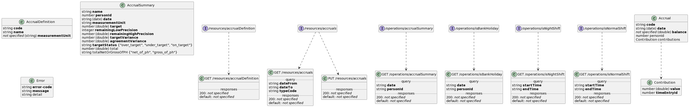

<!-- Generator: Widdershins v4.0.1 -->

<h1 id="accruals">Accruals v0.1.0</h1>

Manages access to Accrual data. A thin layer over the data store with some convenience endpoints to hide the complexity of joining data



<h1 id="accruals-default">Default</h1>

## getAccrualDefinitions

<a id="opIdgetAccrualDefinitions"></a>

`GET /resources/accrualDefinition`

*Get all AccrualDefinition resources known to the API*

> Example responses

> 200 Response

```json
{
  "code": "string",
  "name": "string",
  "measurementUnit": null
}
```

<h3 id="getaccrualdefinitions-responses">Responses</h3>

|Status|Meaning|Description|Schema|
|---|---|---|---|
|200|[OK](https://tools.ietf.org/html/rfc7231#section-6.3.1)|Expected response to a valid request|Inline|
|default|Default|unexpected error|Inline|

<h3 id="getaccrualdefinitions-responseschema">Response Schema</h3>

Status Code **200**

|Name|Type|Required|Restrictions|Description|
|---|---|---|---|---|
|» code|string|true|none|The code of the type of Accrual that this resource is an instance of eg "AnnualHours". Can be used to retrieve meta-data about this type of Accrual|
|» name|string|true|none|The user friendly name of this type of Accrual. Intended to be displayed in a user interface|
|» measurementUnit|any|true|none|The way that the balance of an Accrual of this `accrual_type` should be interpreted eg "hours" or "count"|

Status Code **default**

|Name|Type|Required|Restrictions|Description|
|---|---|---|---|---|
|» error-code|string|true|none|Unique within the context of the API and specific to the category of error being reported|
|» message|string|true|none|A user friendly summary of the issue. Should be suitable to display in a user interface|
|» detail|string|false|none|Detail to help the client-developer understand the issue|

<aside class="success">
This operation does not require authentication
</aside>

## findAccruals

<a id="opIdfindAccruals"></a>

`GET /resources/accruals`

*Get all Accrual instances that meet the query criteria*

<h3 id="findaccruals-parameters">Parameters</h3>

|Name|In|Type|Required|Description|
|---|---|---|---|---|
|dateFrom|query|string(date)|true|The id of the pet to retrieve|
|dateTo|query|string(date)|true|The id of the pet to retrieve|
|typeCode|query|string(date)|true|The id of the pet to retrieve|

> Example responses

> 200 Response

```json
{
  "code": "string",
  "date": "2019-08-24",
  "balance": null,
  "contributions": {
    "value": 0,
    "timeEntryId": 0
  }
}
```

<h3 id="findaccruals-responses">Responses</h3>

|Status|Meaning|Description|Schema|
|---|---|---|---|
|200|[OK](https://tools.ietf.org/html/rfc7231#section-6.3.1)|Expected response to a valid request|Inline|
|default|Default|unexpected error|Inline|

<h3 id="findaccruals-responseschema">Response Schema</h3>

Status Code **200**

|Name|Type|Required|Restrictions|Description|
|---|---|---|---|---|
|» code|string|true|none|The code of the type of Accrual that this resource is an instance of eg "AnnualHours". Can be used to retrieve meta-data about this type of Accrual|
|» date|string(date)|true|none|The date that this resource is associated with|
|» balance|any|true|none|The total of all associated contribution values plus the balance from the previous day's Accrual|
|» contributions|[Contribution](#schemacontribution)|false|none|The set of contributions that help to make up this resource's balance|
|»» value|number(double)|true|none|Holds the count that this resource contributes to the owning Accrual resource's balance|
|»» timeEntryId|number|true|none|The identifier of the TimeEntry that contributed some or all of this resource's value|

Status Code **default**

|Name|Type|Required|Restrictions|Description|
|---|---|---|---|---|
|» error-code|string|true|none|Unique within the context of the API and specific to the category of error being reported|
|» message|string|true|none|A user friendly summary of the issue. Should be suitable to display in a user interface|
|» detail|string|false|none|Detail to help the client-developer understand the issue|

<aside class="success">
This operation does not require authentication
</aside>

## updateAccruals

<a id="opIdupdateAccruals"></a>

`PUT /resources/accruals`

*Update a collection of Accrual resources atomically*

> Example responses

> default Response

```json
{
  "error-code": "string",
  "message": "string",
  "detail": "string"
}
```

<h3 id="updateaccruals-responses">Responses</h3>

|Status|Meaning|Description|Schema|
|---|---|---|---|
|200|[OK](https://tools.ietf.org/html/rfc7231#section-6.3.1)|Null response|None|
|default|Default|unexpected error|Inline|

<h3 id="updateaccruals-responseschema">Response Schema</h3>

Status Code **default**

|Name|Type|Required|Restrictions|Description|
|---|---|---|---|---|
|» error-code|string|true|none|Unique within the context of the API and specific to the category of error being reported|
|» message|string|true|none|A user friendly summary of the issue. Should be suitable to display in a user interface|
|» detail|string|false|none|Detail to help the client-developer understand the issue|

<aside class="success">
This operation does not require authentication
</aside>

## isBankHoliday

<a id="opIdisBankHoliday"></a>

`GET /operations/isBankHoliday`

*Determine whether or not the given day is a Bank holiday (or a substitute bank holiday)*

<h3 id="isbankholiday-parameters">Parameters</h3>

|Name|In|Type|Required|Description|
|---|---|---|---|---|
|date|query|string(date)|true|The date whose Bank holiday status is to be determined|
|personId|query|string|true|The person has a bearing on whether a date is a Bank holiday|

> Example responses

> 200 Response

```json
true
```

<h3 id="isbankholiday-responses">Responses</h3>

|Status|Meaning|Description|Schema|
|---|---|---|---|
|200|[OK](https://tools.ietf.org/html/rfc7231#section-6.3.1)|A boolean value. True if the date is a Bank holiday in the context of the person otherwise False|boolean|
|default|Default|unexpected error|Inline|

<h3 id="isbankholiday-responseschema">Response Schema</h3>

Status Code **default**

|Name|Type|Required|Restrictions|Description|
|---|---|---|---|---|
|» error-code|string|true|none|Unique within the context of the API and specific to the category of error being reported|
|» message|string|true|none|A user friendly summary of the issue. Should be suitable to display in a user interface|
|» detail|string|false|none|Detail to help the client-developer understand the issue|

<aside class="success">
This operation does not require authentication
</aside>

## isNightShift

<a id="opIdisNightShift"></a>

`GET /operations/isNightShift`

*Determine whether or not the given time period falls within the bounds of a night shift*

<h3 id="isnightshift-parameters">Parameters</h3>

|Name|In|Type|Required|Description|
|---|---|---|---|---|
|startTime|query|string(date-time)|true|The start of the time period to be assessed|
|endTime|query|string(date-time)|true|The end of the time period to be assessed|

> Example responses

> 200 Response

```json
true
```

<h3 id="isnightshift-responses">Responses</h3>

|Status|Meaning|Description|Schema|
|---|---|---|---|
|200|[OK](https://tools.ietf.org/html/rfc7231#section-6.3.1)|A boolean value. True if the time period encapsulated by the startTime and endTime params is a Night shift otherwise False|boolean|
|default|Default|unexpected error|Inline|

<h3 id="isnightshift-responseschema">Response Schema</h3>

Status Code **default**

|Name|Type|Required|Restrictions|Description|
|---|---|---|---|---|
|» error-code|string|true|none|Unique within the context of the API and specific to the category of error being reported|
|» message|string|true|none|A user friendly summary of the issue. Should be suitable to display in a user interface|
|» detail|string|false|none|Detail to help the client-developer understand the issue|

<aside class="success">
This operation does not require authentication
</aside>

## isNormalShift

<a id="opIdisNormalShift"></a>

`GET /operations/isNormalShift`

*Determine whether or not the given time period falls within the bounds of a normal shift*

<h3 id="isnormalshift-parameters">Parameters</h3>

|Name|In|Type|Required|Description|
|---|---|---|---|---|
|startTime|query|string(date-time)|true|The start of the time period to be assessed|
|endTime|query|string(date-time)|true|The end of the time period to be assessed|

> Example responses

> 200 Response

```json
true
```

<h3 id="isnormalshift-responses">Responses</h3>

|Status|Meaning|Description|Schema|
|---|---|---|---|
|200|[OK](https://tools.ietf.org/html/rfc7231#section-6.3.1)|A boolean value. True if the time period encapsulated by the startTime and endTime params is a Normal shift otherwise False|boolean|
|default|Default|unexpected error|Inline|

<h3 id="isnormalshift-responseschema">Response Schema</h3>

Status Code **default**

|Name|Type|Required|Restrictions|Description|
|---|---|---|---|---|
|» error-code|string|true|none|Unique within the context of the API and specific to the category of error being reported|
|» message|string|true|none|A user friendly summary of the issue. Should be suitable to display in a user interface|
|» detail|string|false|none|Detail to help the client-developer understand the issue|

<aside class="success">
This operation does not require authentication
</aside>

# Schemas

<h2 id="tocS_Contribution">Contribution</h2>
<!-- backwards compatibility -->
<a id="schemacontribution"></a>
<a id="schema_Contribution"></a>
<a id="tocScontribution"></a>
<a id="tocscontribution"></a>

```json
{
  "value": 0,
  "timeEntryId": 0
}

```

A contribution towards the balance of an Accrual

### Properties

|Name|Type|Required|Restrictions|Description|
|---|---|---|---|---|
|value|number(double)|true|none|Holds the count that this resource contributes to the owning Accrual resource's balance|
|timeEntryId|number|true|none|The identifier of the TimeEntry that contributed some or all of this resource's value|

<h2 id="tocS_Accrual">Accrual</h2>
<!-- backwards compatibility -->
<a id="schemaaccrual"></a>
<a id="schema_Accrual"></a>
<a id="tocSaccrual"></a>
<a id="tocsaccrual"></a>

```json
{
  "code": "string",
  "date": "2019-08-24",
  "balance": null,
  "contributions": {
    "value": 0,
    "timeEntryId": 0
  }
}

```

.

### Properties

|Name|Type|Required|Restrictions|Description|
|---|---|---|---|---|
|code|string|true|none|The code of the type of Accrual that this resource is an instance of eg "AnnualHours". Can be used to retrieve meta-data about this type of Accrual|
|date|string(date)|true|none|The date that this resource is associated with|
|balance|any|true|none|The total of all associated contribution values plus the balance from the previous day's Accrual|
|contributions|[Contribution](#schemacontribution)|false|none|The set of contributions that help to make up this resource's balance|

<h2 id="tocS_AccrualDefinition">AccrualDefinition</h2>
<!-- backwards compatibility -->
<a id="schemaaccrualdefinition"></a>
<a id="schema_AccrualDefinition"></a>
<a id="tocSaccrualdefinition"></a>
<a id="tocsaccrualdefinition"></a>

```json
{
  "code": "string",
  "name": "string",
  "measurementUnit": null
}

```

.

### Properties

|Name|Type|Required|Restrictions|Description|
|---|---|---|---|---|
|code|string|true|none|The code of the type of Accrual that this resource is an instance of eg "AnnualHours". Can be used to retrieve meta-data about this type of Accrual|
|name|string|true|none|The user friendly name of this type of Accrual. Intended to be displayed in a user interface|
|measurementUnit|any|true|none|The way that the balance of an Accrual of this `accrual_type` should be interpreted eg "hours" or "count"|

<h2 id="tocS_Error">Error</h2>
<!-- backwards compatibility -->
<a id="schemaerror"></a>
<a id="schema_Error"></a>
<a id="tocSerror"></a>
<a id="tocserror"></a>

```json
{
  "error-code": "string",
  "message": "string",
  "detail": "string"
}

```

A container for returning error conditions.

### Properties

|Name|Type|Required|Restrictions|Description|
|---|---|---|---|---|
|error-code|string|true|none|Unique within the context of the API and specific to the category of error being reported|
|message|string|true|none|A user friendly summary of the issue. Should be suitable to display in a user interface|
|detail|string|false|none|Detail to help the client-developer understand the issue|

