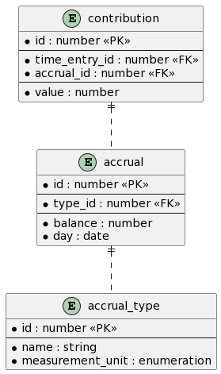

<h1 id="accruals">Accruals v0.1.0</h1>

The Accruals container stores a number of entities. Principle amongst them is the `accrual` table

# Tables
<h2 id="tocS_TimeEntry">time_entry</h2>

A `TimeEntry` carries the time periods during which employees have performed a business activity (e.g. PCP, dog handling etc) or HR activity (e.g. leaves, training etc). `TimeEntry` is the actual recording of hours done by employees as per their roster. Encapsulates day and time (to the minute). 

A `TimeEntry` will originate with the TimeCard container and will be consumed by the Accruals container as an event

### Properties

|Name|Type|Required|Restrictions|Description|
|---|---|---|---|---|
|id|PK|true|none|Assigned by the Accruals container though ideally the id from the `TimeEntry` published by the TimeCard container should be used to make reconciliation easier|
|version|number|true|none|The version of the `time_entry` record as assigned by the TimeCard container. The Accruals container has no need to change this. This field is simply a copy of the value from the `time_entry` record published by the TimeCard container|
|owner_id|number|true|none|The id of the Person who owns this `time_entry` record i.e. the Person who has performed the activity in the given time period|
|start_time|date-time|true|none|The start time of the activity that was worked (to the minute)|
|end_time|date-time|true|none|The end time of the activity that was worked (to the minute)|
|meal_break_allowence|double|false|none|The amount of time that the person corresponding to the owner_id is permitted to take for a meal break (to the minute)|
|meal_break_taken|double|true|none|The amount of time that th eperson corresponding to the owner_id actually took for their meal break (to the minute)|

<h2 id="tocS_FlexChange">flex_change</h2>

A FlexChange is used to carry details of an alteration to a planned shift. For a FlexChange to be created there are business rules governing how far in advance of the shift the alteration was made.

A FlexChange will originate with the TimeCard container and will be consumed by the Accruals container as an event.

### Properties

|Name|Type|Required|Restrictions|Description|
|---|---|---|---|---|
|id|PK|true|none|Assigned by the Accruals container though ideally the id from the `FlexChange` published by the TimeCard container should be used to make reconciliation easier|
|time_entry_id|FK ([`TimeEntry`](#tocS_time_entry))|true|none|The id of the `time_entry` record associated with the FlexChange|

<h2 id="tocS_Accrual">accrual</h2>

Represents the balance of an accrual on a given date.

### Properties

|Name|Type|Required|Restrictions|Description|
|---|---|---|---|---|
|id|PK|true|none|the identifier for this Accrual|
|type_id|FK ([accrual_type](#tocS_Accrual_Type))|true|none|the type of this Accrual. Sometimes referred to as the "module"|
|balance|number|true|none|The remaining balance on for the accrual on the given date. Default is zero|
|date|date|true|none|The date that the Accrual is associated with|

<h2 id="tocS_Contribution">contribution</h2>

A contribution towards the balance of an Accrual

### Properties

|Name|Type|Required|Restrictions|Description|
|---|---|---|---|---|
|id|PK|true|none|the identifier for this Contribution|
|time_entry_id|FK ([time_entry](#tocS_TimeEntry))|true|none|The TimeEntry records an amount of time that backs the contributedHours property|
|accrual_id|FK ([accrual](#tocS_Accrual))|true|none|The balance of the `Accrual` that this `Contribution` effects|
|value|number|true|none|Holds the count that this `Contribution` negates the `Accrual`'s balance by|

**REF DATA - accrual type and units etc, name**
<h2 id="tocS_Accrual_Type">accrual_type</h2>

Reference data that linked to a type of `Accrual`

### Properties

|Name|Type|Required|Restrictions|Description|
|---|---|---|---|---|
|id|PK|true|none|the identifier for this `accrual_type` record|
|name|string|true|none|The human readable name for this `accrual_type` |
|measurement_unit|string|true|one of 'hours' or 'count'|The way that the balance of an Accrual of this `accrual_type` should be interpreted|
